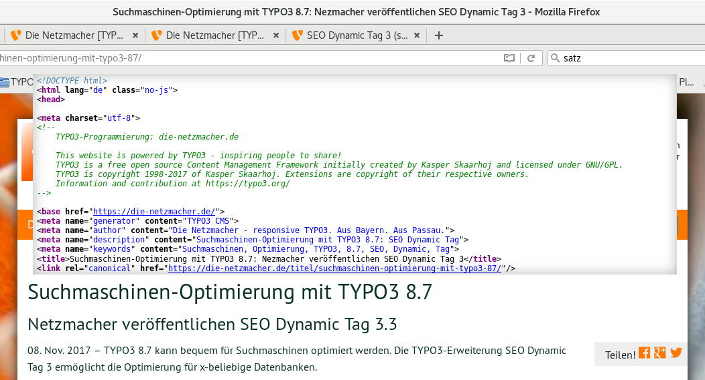
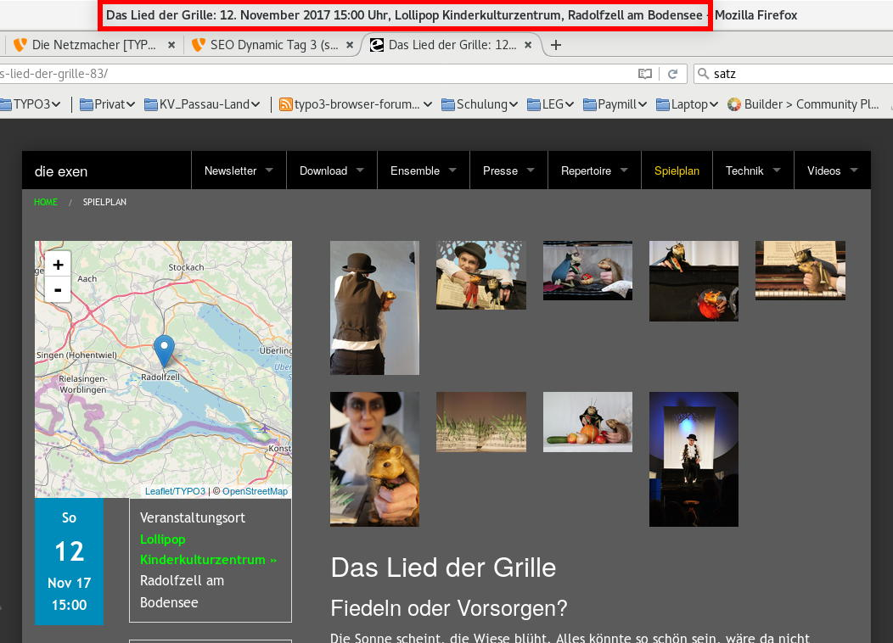
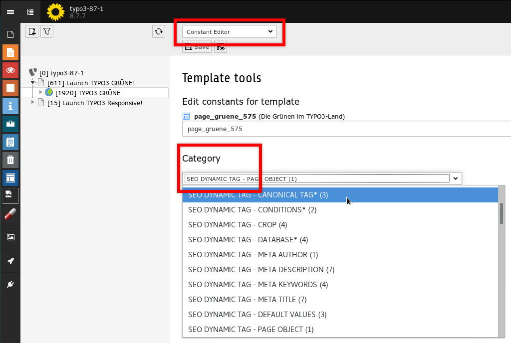

.. ==================================================
.. FOR YOUR INFORMATION
.. --------------------------------------------------
.. -*- coding: utf-8 -*- with BOM.

.. include:: ../../Includes.txt

Screenshots
===========

.. _screenshots_frontend:

Frontend
--------

.. _figure_seo_frontend:

	SEO - Search Engine Optimisation - with SEO Dynamic Tag

SEO - Search Engine Optimisation - with SEO Dynamic Tag: it generates the title tag, 
the canonical tag and the meta tags author, keywords and description. It is possible to 
concatenate up to three fields from the database. In the figure above the title and
the subtitle of a news (here: Organiser) is concatenated. It is configure by the
user-interface. See section Backend below.

	SEO - Search Engine Optimisation - with SEO Dynamic Tag

The figure above is a sample for the concatation of four database fields:
title, date and time, organiser and location. This is possible, if you edit
TypoScript directly. The sample above is generated by the extension Organiser (org).
Integrators have to do nearby nothing, because the Organiser has a ready-to-use
template. 

.. _screenshots_backend:

Backend
-------

	User interface of SEO Dynamic Tag: the Constant-Editor

