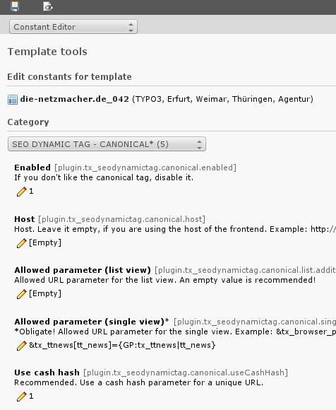
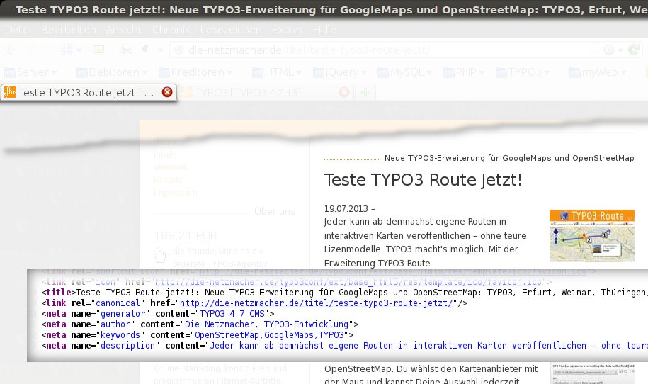

.. ==================================================
.. FOR YOUR INFORMATION
.. --------------------------------------------------
.. -*- coding: utf-8 -*- with BOM.

.. include:: ../../Includes.txt

Screenshots
===========

.. _screenshots_backend:

Backend
-------

	One of nine forms of the user interface of SEO Dynamic Tag.

.. _screenshots_frontend:

Frontend
--------

.. _figure_seo_frontend:

	SEO Dynamic Tag generates the title tag, the canonical tag and the meta tags author, keywords and description.